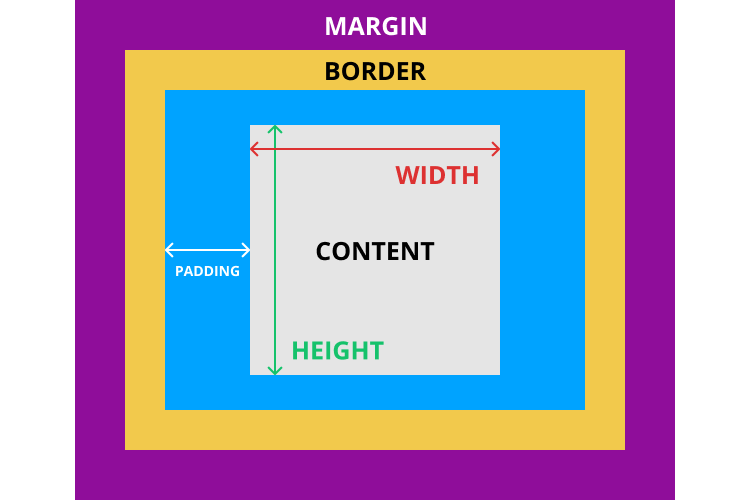

# HTML 
* Hypertext Markup Language
* Hypertext - uses http portion of internet markup -> code you write is annotated with keywords -> browser reads keywords and produces visual stuff
* language - is human readable aswell, has some rules
* it is a sequence of tags that tell browsers how to make or show a webpage
* standard markup language for creating web pages and web apps (together with CSS and JS to create the foundation of the web)

## HTML Elements

* unit of content - HTML element
* basic structure of element: 

```
<p class="dog"> content </p>
```

1. The opening tag
2. The content (between the opening and closing tags). Only this is displayed
3. Closing tag - end of element 
4. (optional) The attribute name and value


2 types of tags:
* block elements
  *  structure the main parts of the page
  * `<p>`, lists (`<ul>`, `<ol>`), headings(`<h1>` to `<h6>`), article `<article>`, section `<section>`, long quotes `<blockquotes>`
* inline elements
  * differentiate part of a text, to give it particular function or meaning (usually one/a few words)
  * `<a>`, emphasized words `<em>`, important words `<strong>`


## Attributes 

* additional info about an element
* always specified in start tag
* id, src, href 
* come in name/value pairs `name="value"`
* links
  * web was initially designed to be an information network of documents "linked" between each other 
  * HTML "HyperText" defines what kind of links we use: hypertext links, a.k.a hyperlins
  * `href` - hyperlink reference
  * 3 types of link destinations
   * anchor targets (same page)
   * relative URLs (same website)
   * absolute URLs (different website)
  * specify the relationship between the current and linked document with the `rel` attribute
  * specify where to open the linked document with the `target` attribute

## DOM 
* document object model (the model our web document is presented as)
* tree structure 


## HTML DOCUMENTS

* let them know you are using html with the document type declaration: 
* html files require certain elements to set up the document properly

```<!DOCTYPE html>```

* is an instruction, must be the first line of code
* what type of document to expect, version of HTML (html5 with the above)
* prevents browser from going into [quirks mode](https://developer.mozilla.org/en-US/docs/Web/HTML/Quirks_Mode_and_Standards_Mode)

### The Head 

1. Declared to the browser that your code is HTML with `<!DOCTYPE html>`
2. Added the HTML element `<html>` that will contain the rest of the code
3. the `<head>` goes above the `<body>` element

### Metadata

* contained in `<head>` 
* information about the page that isn't displayed directly on the web page
* unlike information in the `<body>`, the metadata in the head is information about the page itself 

### Title 

* a browser's tab displays the title specified in the `<title>` tag (always inside the `<head>`)

### Body
 
* text, images and buttons can be added to the body

### Hierarchy 

* HTML is organized as a collection of family tree relationships
* element contained inside another element -> child of that element
* child element is nested inside the parent element
* relationships between elements and their ancestors and descendents is known as hierarchy
* child elements can inherit behavior and styling from their parent element

### Semantic elements

* structure elements allow you to organize the main parts of the page
* a typical webpage can include: 
  * `<header>` as the first element
  * `<nav>` as a list of links that go to different pages of the website
  * `<h1>` as the title of the page
  * `<article>` as the main content 
  * `<footer>` as the last element fo the page 

### Forms

* forms in real life - write down info and give it to someone to process
* HTML `<form>` element is responsible for collecting info to send somewhere else
* forms are the "money pages" - how e-commerce sites sell their products etc

#### Input types, select and text area

* text, checkbox and radio button forms are spcfieid by an `input type`

```
<!-- A text input -->
<input type="text" />
<!-- A checkbox -->
<input type="checkbox" />
<!-- A radio button -->
<input type="radio" />
```

* a dropdown menu can be created usng `select`

```
<label for="color-select">Choose a color:</label>

<select id="color-select">
  <option value="">--Please choose an option--</option>
  <option value="blue">Blue</option>
  <option value="red">Red</option>
  <option value="green">Green</option>
  <option value="yellow">Yellow</option>
  <option value="orange">Orange</option>
  <option value="pink">Pink</option>
</select>
```

* `textarea` creates a more free-form text field 

```
<label for="learn">What do you hope to learn today?</label>

<textarea id="learn" name="learn" rows="5" cols="30">
I hope to learn about...
</textarea>
```

# CSS

Links: *
* [css-tricks](https://css-tricks.com/)

* Cascading Style Sheets
* Selectors - let you select/identify specific HTML elements (IDs, class, type)
* CSS can select HTML elements by using an element’s tag name. A tag name is the word (or character) between HTML angle brackets.

```
p {
  color: red;
}
```
* where `p` is the selector, `color` is the property, `red` is the value

* elements can be selected using the `class` attribute
* to select an HTML element by its class using CSS, a period (`.`) must be prepended to the class’s name.
* for more specificity, you may also select elements for CSS using an `id` attribute
* in CSS, to select an id you prepend `#`
* pseudo-class is a keyword added to a selector that specifies a special state of the selected element
* for example, `:hover` can be used to change a button's color when the user's pointer hovers over it

```
selector:pseudo-class {
  property: value;
}
```

## Attributes selector

* Attribute selectors are a special kind of selector that will match elements based on their attributes and attribute values
* Their generic syntax consists of square brackets (`[]`) containing an attribute name followed by an optional condition to match against the value of the attribute.
* Attribute selectors can be divided into two categories depending on the way they match attribute values:
  * Presence and value attribute selectors and
  * Substring value attribute selectors.
* These attribute selectors try to match an exact attribute value:
  * `[attr]` This selector will select all elements with the attribute attr, whatever its value.
  * `[attr=val]` This selector will select all elements with the attribute attr, but only if its value is val.
  * [attr~=val] This selector will select all elements with the attribute attr, but only if val is one of a space-separated list of words contained in attr's value. (This one is a bit more complex, so checking some [documentation](https://developer.mozilla.org/en-US/docs/Web/CSS/Attribute_selectors) might be helpful.)

## Multiple selectors

* We can select multiple HTML elements in the same CSS rule by separating them with commas. Add this to our styles.css file:

```
h1,
h2,
h3,
h4,
h5,
h6 {
  font-family: "Helvetica", "Arial", sans-serif;
}
```

## Linking CSS to HMTL

### Inline
* Although CSS is a different language than HTML, it’s possible to write CSS code directly within HTML code using inline styles.
* To style an HTML element, you can add the style attribute directly to the opening tag. After you add the attribute, you can set it equal to the CSS style(s) you’d like applied to that element.

```
<p style="color: red; font-size: 20px;">I'm learning to code!</p>
```
* Inline styles are the most specific way to define CSS. The color and text-decoration properties we defined here trump everything. Even if we went back and added a text-decoration: none to our `<style>` element, it wouldn’t have any effect.

* Inline styles should be avoided at all costs because they make it impossible to alter styles from an external stylesheet. If you ever wanted to re-style your website down the road, you can’t just change a few rules in your global styles.css file—you’d have to go through every single page and update every single HTML element that has a style attribute. It’s horrifying.

* That said, there will be many times when you need to apply styles to only a specific HTML element. For this, you should always use CSS classes instead of inline styles.

### Style Tag

* Fortunately, HTML allows you to write CSS code in its own dedicated section with the `<style>` element. CSS can be written between opening and closing `<style>` tags. To use the `<style>` element, it must be placed inside of the `<head>` element.

```
<head>
  <style>
    p {
      color: red;
      font-size: 20px;
    }
  </style>
</head>
```

### External Stylesheets

* When HTML and CSS code are in separate files, the files must be linked. Otherwise, the HTML file won’t be able to locate the CSS code, and the styling will not be applied.
* You can use the `<link>` element to link HTML and CSS files together. The `<link>` element must be placed within the head of the HTML file. It is a self-closing tag and requires the following three attributes:
  * `href` — like the anchor element, the value of this attribute must be the address, or path, to the CSS file.
  * `type` — this attribute describes the type of document that you are linking to (in this case, a CSS file). The value of this attribute should be set to text/css.
  * `rel` — this attribute describes the relationship between the HTML file and the CSS file.

```
<link href="https://udacity.com/style.css" type="text/css" rel="stylesheet" />
```

Using a relative path is very common way of linking a stylesheet.

```
<link rel="stylesheet" href="styles.css" />
```
Note that in HTML5, you actually don’t have to specify type="text/css" here.

* You can have all your styles living inside one main CSS file, or you can use @import to break your styles (one for layout, one for images, one for blog cards, etc.) into a number of smaller, focused files. This makes it a lot easier to manage the styles they contain and your code is more scalable and modular!

```
// at the top of your main CSS file

@import “./layout”;
@import “./images”;
@import “./blog-cards”;
```

## Specificity

* Multiple styles for the same element, browser needs a mechanism to determine which style to apply 
* Style hierarchy
* Because elements can have multiple CSS selectors, there is a hierarchy for the weight given to each type of selector. Here is the logical order of selectors from least to most weight assigned:
 * Type selectors (e.g., `h1`) and pseudo-elements (e.g., `::before`).
 * Class selectors (e.g., `.example`), attributes selectors (e.g., `[type="radio"]`) and pseudo-classes (e.g., `:hover`).
 * ID selectors (e.g., `#example`).

* There is a way to escape or override the specificity evaluation of elements using the !important keyword after an individual CSS property rule, but a couple important reminders:
* Always look for a way to use specificity before even considering !important. Never use !important on site-wide CSS.

## The Box Model



* First, we have the content of the box itself, which has a height and width.
* Next is padding - the space between the box’s content and its border. Note that padding is in addition to the content’s height and width, and is considered to be inside the element itself.
* The border `border-bottom: 1px solid #5D6063;`
* Last is the margin, which surrounds the rest of the box. It is the space between the box and surrounding boxes.

## Display 

### Inline & Block

* The biggest distinction between outside display options is whether elements occupy the entire horizontal line they are on (remember that elements are organized hierarchically on the DOM) or if they only occupy the width they need and then the following element can be placed next to them on the same horizontal line.
 * `block` - each rectangle would take up its own line and would be positioned one on top of the other. 
 * `inline` 
  * Most often used to highlight specific text within a larger text element, `span` elements are a common example
  * Elements set to inline display have no width or height and only occupy the space that their text property (or `.innerHTML` property) takes up
* `inline-block` - just as `inline`, but you can set `width`, `height`
* `none` - doesn't display the element

### Z-index

* When elements overlap, they are ordered on the z-axis (i.e., which element covers another). The z-index CSS property can be used to specify the z-order of these overlapping elements. Overlapping elements with a larger z-index cover those with a smaller one.

* Without explicitly using `z-index` the last element written to the DOM (the last element you wrote in your code) will appear on top of all the others, and so on up the chain of your elements.

### Absolute vs Relative units

* Many CSS properties require a unit of measurement. There’s a lot of units available, but the most common ones you’ll encounter are `px` (pixel) and `em` (pronounced like the letter m). The former is what you would intuitively call a pixel, regardless of whether the user has a retina display or not, and the latter is the current font size of the element in question.

There are broadly two types of units of measurement for CSS properties, absolute and relative.

* Absolute
 * `px`
 * `in`
 * `mm`
 * `cm`

Absolute measurements are set values regardless of anything having to do with your program or the browser. `px` is the most common absolute unit of measurement, and many font sizes on the web for example, are set to somewhere between 12px-30px, A font size set to 16px will appear the same size no matter how big the screen.

* Relative
 * `%` - percentage of something, such as screen width
 * `em` - A unit equivalent to the current font size - if 12px font, 2em would be 24px
 * `vw` - units of viewport width (essentially the browser’s rendering space). Each unit is 1/100th of width
 * `vh` - the same as above but for viewport height

The `em` unit is very useful for defining sizes relative to some base font. For example, if you set the `font-size` of body to 16px, you could then set other element’s font-size value relative to that 16px. Here’s what that could look like:
```
body {
 font-size: 16px;
}

#one {
  font-size: 1.5em
}

#two {
  font-size: 0.5em
}
```

### Typography

* Text alignment - The aptly named text-align property defines the alignment of the text in an HTML element - `text-align: left;`
* Underlined Text - The text-decoration property determines whether text is underlined or not. By setting it to none, we can remove the default underline from all of our links ` text-decoration: none;`
* Deleted text - The other common value for text-decoration is line-through to strike out “deleted” text. But, remember that meaning should always be conveyed through HTML—not CSS. It’s better to use the `<ins>` and `<del>` elements instead of adding a line-through style to, say, an ordinary `<p>` element.

* Line Height - `line-height` property determines the amount of space between lines in the same paragraph. In traditional typography, `line-height` is called “leading” because printers used little strips of lead to increase the space between lines of text.

### Font

#### Font Family
* `font-family` is another built-in CSS property that defines the typeface for whatever element you selected. It accepts multiple values because not all users will have the same fonts installed.
* When using fonts on the web, you must first consider what fonts are available to your users. Every operating system, be it Windows, OS X, or Linux, comes with a set of pre-installed fonts that you can use for customizing your website. For a complete list of "web-safe" fonts, follow this [link](https://web.mit.edu/jmorzins/www/fonts.html).
* The way it works is fairly simple. When using the font-family property, you specify the font(s) you want to use in your HTML.
* Then, the browser, starting from left to right, looks at the font(s) you've specified and checks to see if it can render the text using the font(s) you've provided. If it can't use the first font, then the browser moves to the next font, and so-on.
* The purpose for specifying multiple fonts is because not all fonts are available on every operating system. So, specifying multiple, similar fonts ensures users have a consistent experience regardless of the operating system they are using.

#### Font Weight & Style
* In CSS, font weights are expressed as numeric values between 100 and 900. Fortunately, there are relatively standardized, human-friendly terms for each of these numeric values. “Black” usually means 900, “bold” is 700, “regular” is 400, etc. Most families don’t supply a face for every single weight. For example, Roboto is missing “extra light” (200), “semi bold” (600), and “extra bold” (800).

* It’s worth noting that each style and weight combination is designed as an entirely distinct face. In a high-quality font family, the condensed styles aren’t simply squashed versions of the roman faces, nor is the bold face merely a thicker version. Each letter in every face is hand-crafted to ensure it provides a uniform flow to its text.

#### Emphasis & Importance

* For emphasized (usually italics) words, use the `<em>` tag.
* For important words, use the `<strong>` tag. By default, `<strong>` elements are displayed in bold, but keep in mind that it is only the browser’s default behavior. Don’t use `<strong>` only to put some text in bold, but rather to give it more importance.

#### External Fonts

* There are a number of ways to host fonts from external sources. One commonly used example is Google Fonts, which provides a great number of fonts free for use in web projects. If you go to the Google Fonts website linked below, you can select a font and then you will be provided with the line of code to link your font of choice. That link goes in the head section of your code like this:

```
<head>
  <link href="https://fonts.googleapis.com/css?family=Montserrat&display=swap" rel="stylesheet">
</head>
```

* In the CSS portion of your code, you could then set an elements property like this:
```
.box{
  font-family: 'Montserrat', sans-serif;
}
```

#### Colors

* Colors in CSS can be specified by the following methods:

1. Hexadecimal colors
2. RGB colors
3. Predefined/Cross-browser color names
4. RGBA colors
5. HSL colors
6. HSLA colors

* First 3 are the most common: 
 * Hexadecimal Colors - A hexadecimal color is specified with: `#RRGGBB`, where the RR (red), GG (green) and BB (blue) hexadecimal integers specify the components of the color. All values must be between 00 and FF.
 * RGB Colors 
  * An RGB color value is specified with the rgb() function, which has the following syntax: `rgb(red, green, blue)`
  * Each parameter (red, green, and blue) defines the intensity of the color and can be an integer between 0 and 255 or a percentage value (from 0% to 100%).

 * Predefined/Cross-browser Color Names - 140 color names are predefined in the HTML and CSS color specification, list [here](https://developer.mozilla.org/en-US/docs/Web/CSS/color_value)


 


